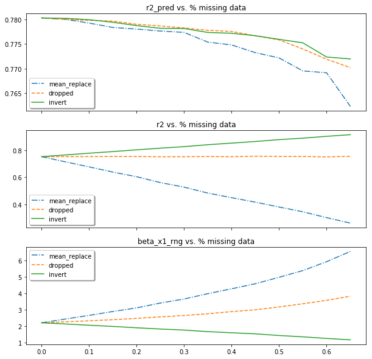

# Introduction
Datasets often have missing data in some or all of the features of interest. Given a data set with independent regressors
 that can be described using ordinary least squares linear regression, what is the best way to fill in any missing data. 
There is extensive study on how to leverage feature relationships to fill in missing data however there is little information
on methods of independent data sets. The objective of this study is to quantify the impact of various data imputation 
methods on the model performance and provide recommendations on best practices for independent datasets. 

# Methodology
## Data Generation

To allow for controlled conditions, the regression dataset was generated rather than observed. 
The data set is described by the simple linear regression equation 
y = $\beta$~0~ + $\beta$~1~x~1~ + $\epsilon$.

Each regressor (x) is a continuous random variable. For this discussion, x~1~ is uniformly
distributed with a min of 0 and a max of 1. The predetermined coefficient value for x~1~ is 10 and 
10 for the intercept.

An additional test set is generated at the same time. This set is withheld to generate prediction metrics 
on the final fitted model. 

## Simulating Missing Data

For a dataset with n observations, each observation is given an equal probability of missing. 
The selection of data to eliminate can be written as `random_choice(observation indexes)` without replacement. In the code, 
`pandas.DataFrame.sample` is used. These index positions were set to `NULL`. The size of
the selection to remove is controlled as the fraction of data missing. The response `y` is never
nulled.

## Filling in Missing Data

### Dropping `NULL` Data
Given a data set with `NULL` values for x~1~, drop observations with `NULL` values. 

### Mean Substitution
Given a data set with `NULL` values for x~1~, compute the mean of the remaining x~1~ values and replace the
`NULL` values with this mean.

### Inversion Imputation

Given a data set with `NULL` values for x~1~ without a `NULL` response:

1. Fit the regression model on
the remaining x~1~ data and the response and extract parameter estimates.

2. Using the inverted simple linear model equation (y - $\beta$~0~)/$\beta$~1~ = x~1~ and the
$\beta$~0~ and $\beta$~1~ estimates, fill in the missing x~1~ values. 

# Runs, Metrics, and Results

Different percentages of data were removed and then imputed using each of the three methods. The regression model
y = $\beta$~0~ + $\beta$~1~x~1~ + $\epsilon$ was fit to the imputed data. 

To understand the impact of both the imputation method and % missing data on model performance, the following metrics were collected for each model fitted;
R^2^, R^2^ Prediction, BIC (Prediction), $\beta$~1~ Estimate, $\beta$~1~ Estimate CI Range, 
and Fraction of true $\beta$~1~ in $\beta$~1~ estimate CI.

Intuitively, dropping data at random from the original dataset is akin to reducing the sample size. The response of 
the performance metrics is inline with the well studied impacts of reduced sample size on linear regression. For example,
as the sample size decreases, the CI for $\beta$~1~ estimate expands.

Inversion imputation forces the missing data onto the line defined by the remaining data. The imputed data set is now biased 
toward the model with which it was imputed. When a model is fit again to the whole data set, the result is a 
tighter CI around the $\beta$~1~ estimate. This bias is magnified as the percentage of missing data increases. The model will
also converge on zero error as the vast majority of data points will be exactly on the inverted model line. Whether or
not this is the correct line, the model will converge on perfect fit as seen in the R^2^ plots.

Figures 1 and 2 show the metrics plots for all three methods at various levels of missing data.

# Runs, Metrics, and Results

Different percentages of data were removed and then imputed using each of the three methods. The regression model
y = $\beta$~0~ + $\beta$~1~x~1~ + $\epsilon$ was fit to the imputed data. 

